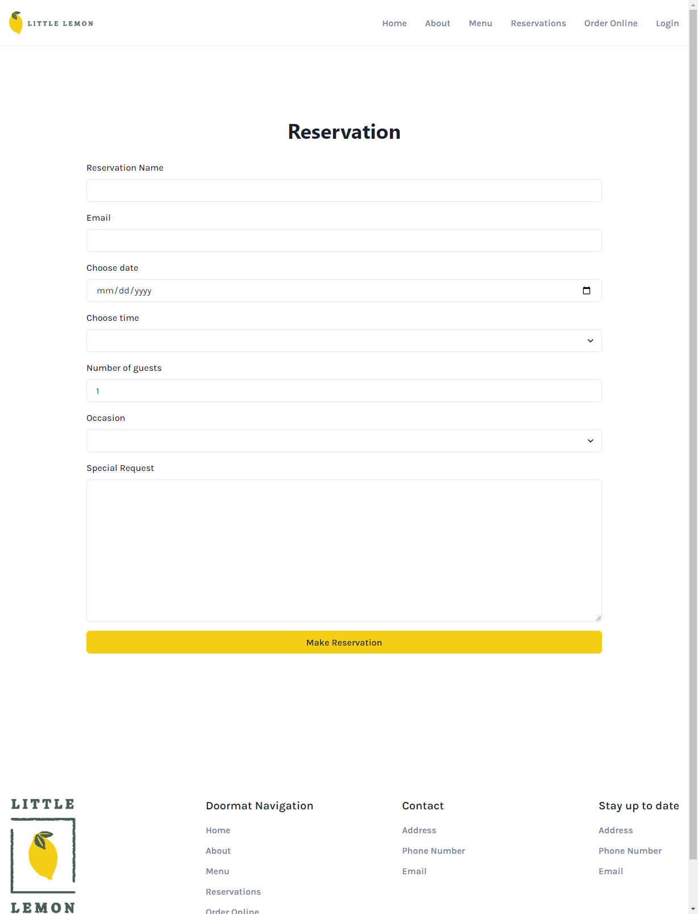

# Little Lemon Restaurant

Final capstone project for Meta Front-end developer program on Coursera, which contains a detailed and responsive website with table-booking functionality built using React.

## Screenshot

### Home Page

### Booking Page

### Tech Stack:

- HTML, CSS, Chakra UI, react-icons
- Formik, Yup
- React, Vite, react-router-dom, Jest, React Testing Library

### Install and Run:
- Install 'npm i'
- Run 'npm start'
- Run 'npm test'
